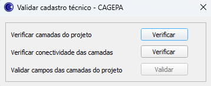

# Plugin Validar GDB - CGP para QGIS

Este é um plugin para o QGIS que facilita a verificação de camadas para cadastro técnico do sistema de Água e Esgoto, seguindo os padrões da **CGP**. O plugin foi desenvolvido em Python e pode ser instalado diretamente no QGIS.

## Funcionalidades

- Verifica se os campos obrigatórios das camadas do projeto foram preenchidas corretamente.
- Verifica as conectividades das camadas (Redes de Agua e Esgoto -> pontos de conexão).
- Validar os campos das camadas do projeto (Verifica se as duas situações anteriores estão validas).

## Tela do plugin



## Como Instalar

1. Adicione o repositório do plugin no QGIS:
   - Vá para **"Plugins"** > **"Gerenciar e Instalar complementos..."**.
   - Na aba **"Opções"** > **"Repositórios de Complementos"** > **"Adicionar..."** e adicione o repositório com as seguintes configurações obrigatórias:
     ```
     Nome: Validar GDB - CGP
     URL: https://raw.githubusercontent.com/hfrade94/Validar_GDB-CGP/refs/heads/main/plugins.xml
     ```
2. Instale o plugin:
   - Pesquise por **"Validar GDB - CGP"** na lista de plugins.
   - Clique em **"Instalar Plugin"**.

## Como Usar

1. Após a instalação, o plugin estará disponível na barra de ferramentas do QGIS.
2. Clique no ícone do plugin para abrir a interface.
3. Execute as verificações.
4. Se estiver tudo ok, ao clicar em **"Validar"** o plugin preenche os campos de 'Data Atualização' nas camadas do projeto.

## Requisitos

- QGIS 3.40
- Python 3.12
